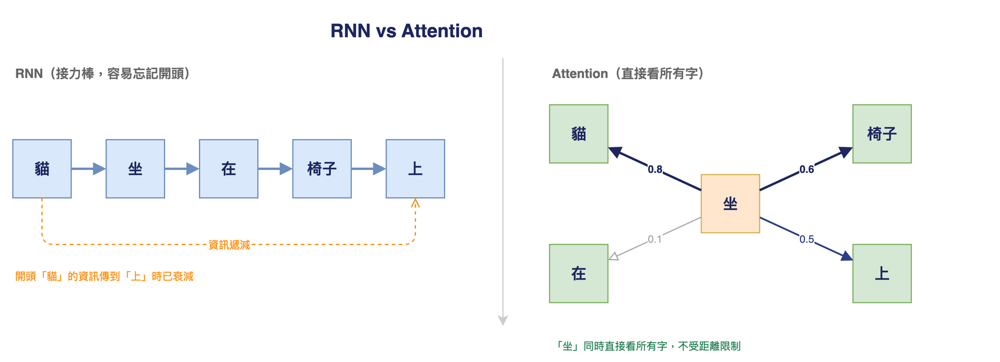
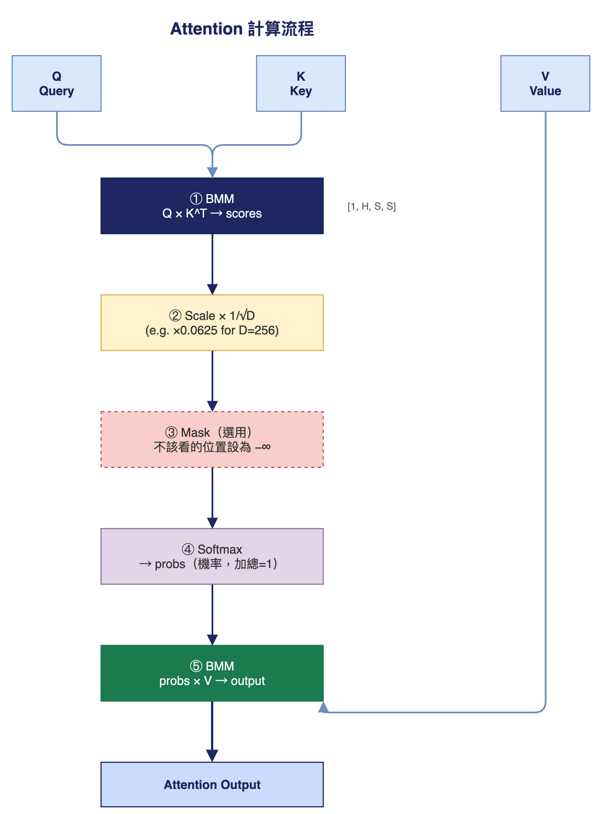
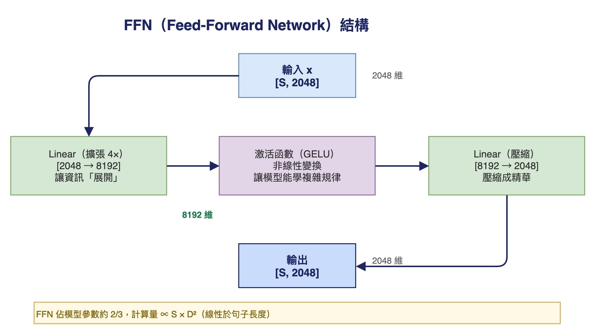
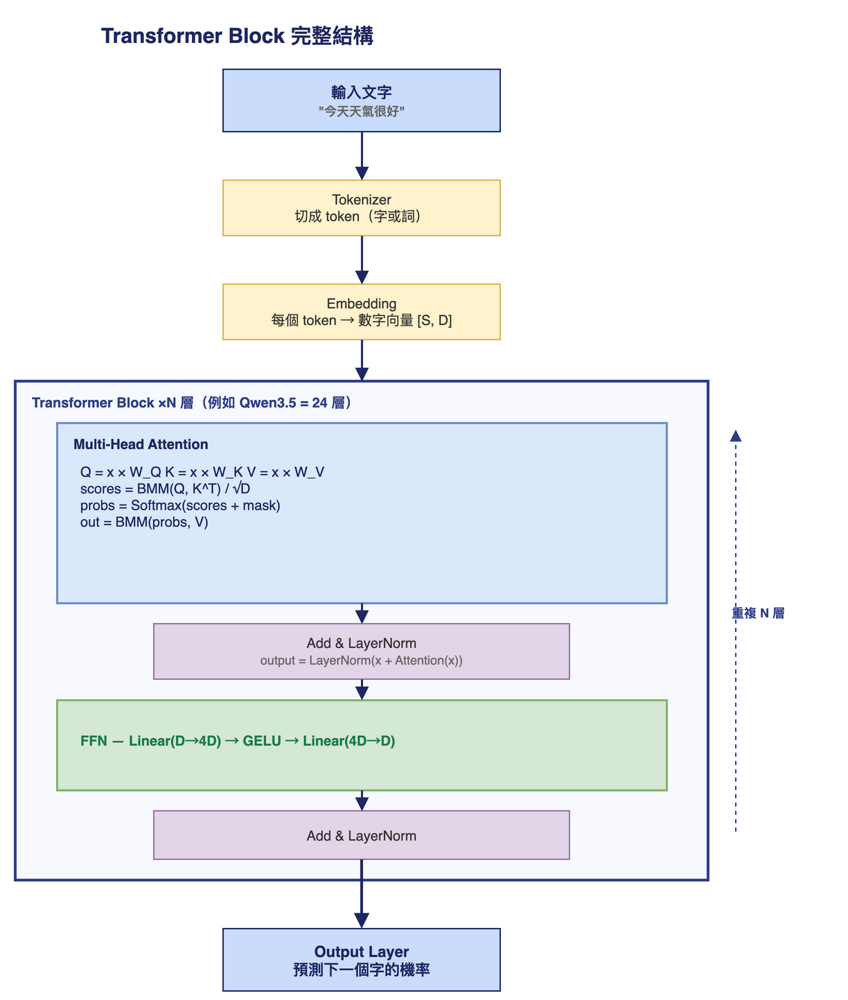
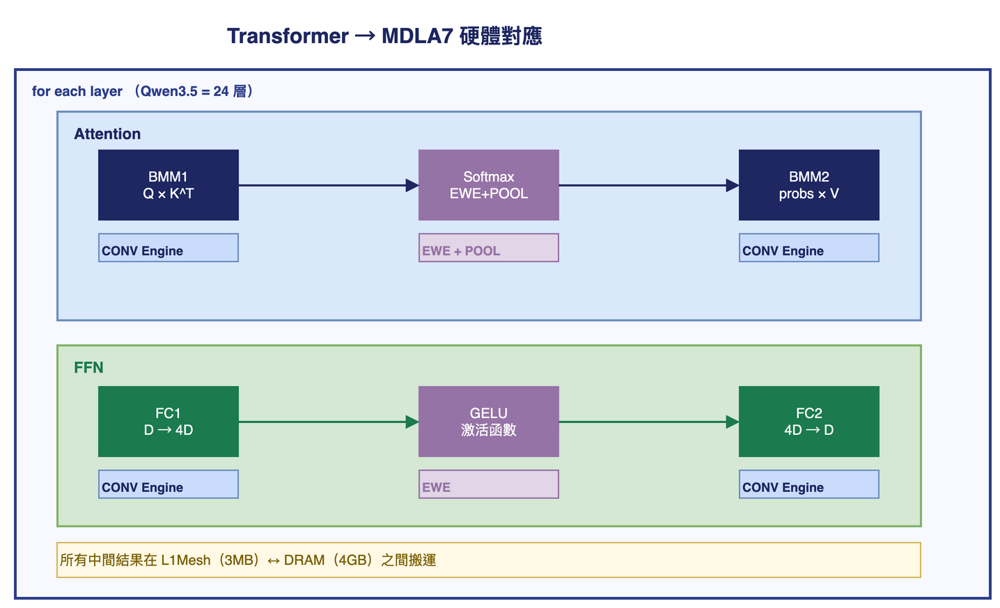

# Transformer 入門筆記

> 寫給小白的解釋。從「圖書館找書」開始，一路到 GPT / LLaMA / Qwen3.5。

---

## 1. 為什麼需要 Transformer？

### 以前的做法：RNN（循環神經網路）

**問題：** 句子很長時，開頭的資訊傳到結尾已經「忘了」。

### Transformer 的解法：Attention（注意力機制）

**不管距離多遠，都能直接關注任意兩個字的關係。**
這就是 Transformer 革命性的地方。



---

## 2. Q、K、V 是什麼？

用「圖書館找書」來理解：

| 符號 | 全名 | 角色 | 比喻 |
|------|------|------|------|
| **Q** | Query（查詢） | 我想找什麼 | 你手上的搜尋關鍵字 |
| **K** | Key（鍵值） | 我是什麼 | 每本書的書名標籤 |
| **V** | Value（內容） | 我裡面有什麼 | 每本書的實際內容 |

### 計算流程



### 具體例子

句子：「貓 坐 在 椅子 上」，模型在理解「坐」這個字：

```
Q = 「坐」想問：「誰在坐？坐在哪裡？」

K（每個字的標籤）：
  貓=動物主語  坐=動作本身  椅子=物體  上=位置

scores（相關分數）：
  貓(0.8)  坐(0.1)  椅子(0.6)  上(0.5)

output = 0.8 × V(貓) + 0.6 × V(椅子) + 0.5 × V(上) + ...
       = 「坐」知道了：主語是貓、地點是椅子上
```

---

## 3. S、H、D 是什麼？

這是描述 Attention 大小的三個參數：

| 符號 | 全名 | 意思 | 比喻 |
|------|------|------|------|
| **S** | Sequence Length | 句子有幾個字 | 圖書館有幾本書 |
| **H** | Heads | 幾個平行視角 | 幾個館員同時找 |
| **D** | Head Dimension | 每個字用幾個數字描述 | 每個標籤有幾個屬性 |

### Q、K、V 的 shape

```
Q [ B,    H,    S,      D   ]
   ↑      ↑     ↑       ↑
 batch  head  句子長  每字維度
 (幾句) (幾個 (幾個字) (特徵數)
        視角)
```

例如 `Q[1, 8, 2048, 256]` = 1個句子、8個視角、2048個字、每字256維。

### S 是最大的瓶頸

```
BMM 計算量 = 2 × B × H × S² × D
                           ↑
                    S 變 2 倍 → 時間變 4 倍！
```

| S | 相當於 | scores 矩陣 | FP16 @1.9GHz |
|---|--------|-------------|--------------|
| 128 | 一小段話 | 128×128 = 16K | ~0.01 ms |
| 512 | 一篇短文 | 512×512 = 262K | ~0.18 ms |
| 1024 | 一篇長文 | 1K×1K = 1M | ~0.71 ms |
| **2048** | **一篇論文** | **2K×2K = 4M** | **~2.2 ms** |
| 4096 | 一本書的章節 | 4K×4K = 16M | ~8.9 ms |

### 多頭注意力（Multi-Head Attention）

H 個頭 = H 個館員，每人用不同角度搜尋：

```
頭 1：專注找「主語是誰」
頭 2：專注找「動詞是什麼」
頭 3：專注找「時間關係」
頭 4：專注找「空間位置」
...
頭 H：（各自學到不同的關注模式）

最後合併 → 比單一角度更全面
```

---

## 4. FFN 是什麼？

FFN = Feed-Forward Network（前饋神經網路）

**Attention 找關係，FFN 做思考。**

### 比喻

- Attention = 查資料：「我知道貓跟坐最相關了」
- FFN = 消化理解：「根據這個關係，我推斷出更深的含義」

### 結構

非常簡單，就兩層矩陣乘法：



### 激活函數是什麼？

```
沒有激活函數：
  兩層矩陣乘法 = 還是矩陣乘法，跟一層一樣
  → 無法學複雜規律

有激活函數（例如 GELU）：
  加入非線性 → 可以學任意複雜的函數
  → 這是神經網路強大的根本原因
```

### Attention vs FFN

| | Attention | FFN |
|--|-----------|-----|
| 做什麼 | 字與字之間的關係 | 每個字自己的特徵提取 |
| 看範圍 | 整個句子 | 只看自己這個位置 |
| 計算量 | S² × D（隨句子爆炸） | S × D²（固定倍數） |
| 模型參數佔比 | 約 1/3 | 約 **2/3** |

---

## 5. Transformer 完整結構



### W_Q、W_K、W_V 是什麼？

```
x（輸入）× W_Q = Q
x（輸入）× W_K = K
x（輸入）× W_V = V
```

W_Q、W_K、W_V 是**學習出來的 weight matrix**（訓練參數）。
模型訓練的過程，就是學習這些 weight，讓輸出越來越準確。

### Add & LayerNorm（殘差連接）是什麼？

```
output = LayerNorm(x + Attention(x))
                   ↑
              加回輸入本身（殘差）

好處：
  - 梯度更容易傳遞（深層網路不會「梯度消失」）
  - 就算某一層學得不好，至少還有原始輸入 x 傳下去
```

---

## 6. 各大模型的規格對照

| 模型 | 層數 N | 頭數 H | 維度 D | 參數量 |
|------|--------|--------|--------|--------|
| BERT-Base | 12 | 12 | 64 | 110M |
| GPT-2 | 24 | 16 | 64 | 1.5B |
| LLaMA-7B | 32 | 32 | 128 | 7B |
| **Qwen3.5** | **24** | **8** | **256** | ~2B |
| GPT-3 | 96 | 96 | 128 | 175B |

> 參數量越大 ≠ 一定越好。訓練資料品質、訓練方式同樣重要。

---

## 7. 跟硬體的關係（MDLA7 視角）



**為什麼 S=2048 很重要：**
- scores 矩陣 = `[1,8,2048,2048]` = **134MB**
- 遠大於 L1Mesh 3MB → 必須分 tile 處理
- 這就是 `softmax.md` 裡 Online Softmax Tiling 要解決的問題

---

## 8. 一句話總結每個概念

| 概念 | 一句話 |
|------|--------|
| **Q K V** | Q 問問題，K 是索引，V 是答案 |
| **Attention** | 讓每個字直接看到所有字的關係，不受距離限制 |
| **Multi-Head** | 多個視角同時找關係，最後合併 |
| **S（Sequence）** | 句子長度，S² 決定 Attention 計算量 |
| **FFN** | 兩層矩陣乘法，把 Attention 結果再「想深一點」 |
| **Transformer Block** | Attention + FFN，疊 N 層就是完整模型 |
| **Residual（殘差）** | 每層加回輸入，讓深層網路能穩定訓練 |

---

## 相關檔案

- `model/QWEN35/qwen35_attn_s2048_fp16.tflite` — 一層 Attention（H=8, S=2048, D=256）
- `model/BMM/bmm_softmax_bmm_2.5ms_1g_int8.tflite` — 壓測用大型 Attention pattern
- `softmax.md` — Softmax 在 MDLA7 上的 tiling 實作計畫
